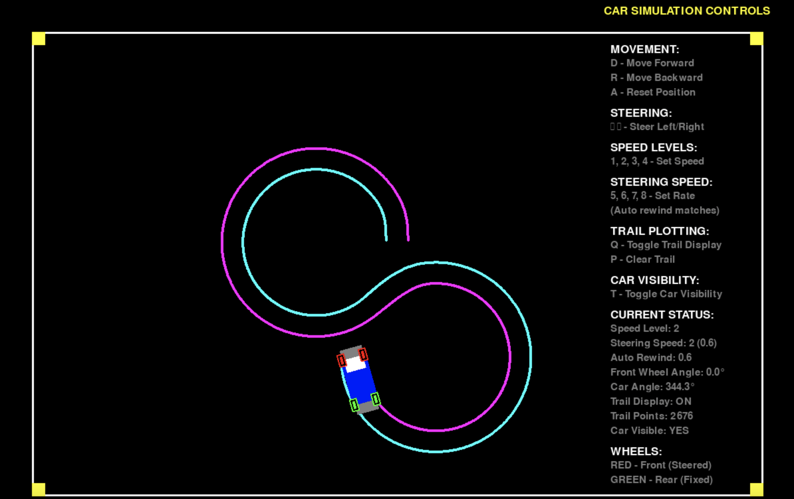
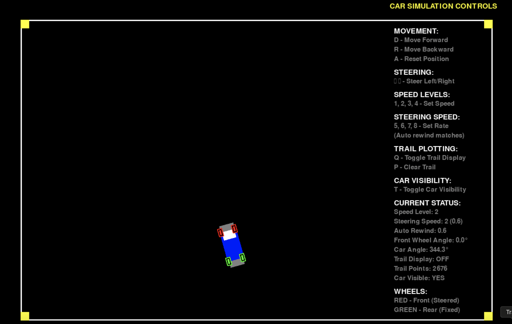
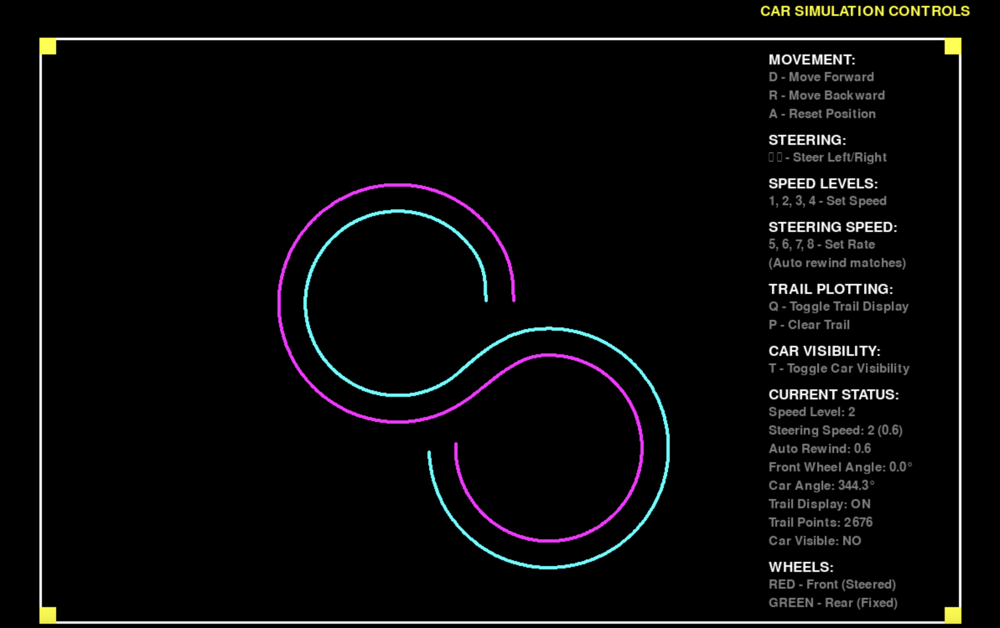

# Car Simulation Game

A realistic car simulation game built with Python and Pygame that demonstrates bicycle model physics for vehicle movement and steering.

## Requirements

- Python 3.x
- Pygame library

## Controls

### Movement
- **D** - Move Forward
- **R** - Move Backward (Reverse)
- **A** - Reset Position to center

### Steering
- **←/→** - Steer Left/Right
- Steering automatically returns to center when not actively turning

### Speed Levels
- **1, 2, 3, 4** - Set movement speed (1=slowest, 4=fastest)

### Steering Speed
- **5, 6, 7, 8** - Set steering sensitivity (5=slowest, 8=fastest)
- Auto-rewind speed automatically matches steering speed

### Trail System
- **Q** - Toggle trail display ON/OFF
- **P** - Clear all trail points

### Visibility
- **T** - Toggle car visibility (useful for trail-only visualization)
